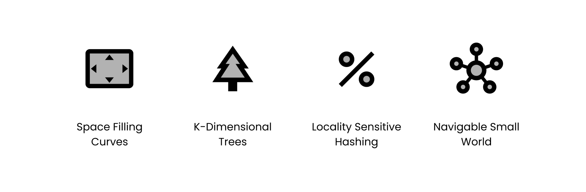
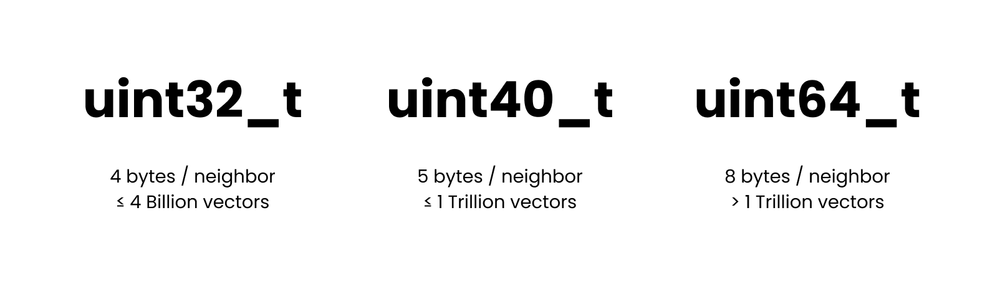

<h1 align="center">USearch</h1>
<h3 align="center">
Smaller & Faster Single-File<br/>
Vector Search Engine<br/>
</h3>
<br/>

<p align="center">
<a href="https://discord.gg/A6wxt6dS9j"></a>
&nbsp;&nbsp;&nbsp;
<a href="https://www.linkedin.com/company/unum-cloud/"></a>
&nbsp;&nbsp;&nbsp;
<a href="https://twitter.com/unum_cloud"></a>
&nbsp;&nbsp;&nbsp;
<a href="https://unum.cloud/post"></a>
&nbsp;&nbsp;&nbsp;
<a href="https://github.com/unum-cloud/usearch"></a>
</p>

- [x] [Single C++11 header][usearch-header] implementation, easily extendible.
- [x] [4B+](#go-beyond-4b-entries) sized space efficient point-clouds with `uint40_t`.
- [x] [Half-precision](#quantize-on-the-fly) support with [`maratyszcza/fp16`](https://github.com/maratyszcza/fp16).
- [x] [View from disk](#view-larger-indexes-from-disk), without loading into RAM.
- [x] [Any metric](#define-custom-metrics), includes: 
  - [x] Euclidean, Dot-product, Cosine,
  - [x] Jaccard, Hamming, Haversine.
  - [x] Hardware-accelerated [`ashvardanian/simsimd`](https://github.com/ashvardanian/simsimd). 
- [x] Variable dimensionality vectors.
- [x] Don't copy vectors if not needed.
- [x] [Bring your threads](#bring-your-threads), like OpenMP.
- [x] Multiple vectors per label.
- [x] [Python](#python) bindings: `pip install usearch`.
- [x] [JavaScript](#java) bindings: `npm install usearch`.
- [x] [Rust](#rust) bindings: `cargo add usearch`.
- [x] [Java](#java) bindings: `cloud.unum:usearch` on GitHub.
- [ ] GoLang bindings.
- [x] Wolfram language bindings.
- [x] For Linux: GCC, Clang.
- [x] For MacOS: Apple Clang.
- [ ] For Windows.
- [ ] Multi-index lookups in Python.
- [ ] Thread-safe `reserve`.
- [ ] Distributed construction with MPI.
- [x] AI + Vector Search = Semantic Search.

[usearch-header]: https://github.com/unum-cloud/usearch/blob/main/include/usearch/usearch.hpp

## Features

### Define Custom Metrics

Most vector-search packages focus on just 2 metrics - "Inner Product distance" and "Euclidean distance".
The lack of dedicated "Cosine distance" can be justified with the simplicity of normalizing such vectors on the fly.
But that hardly exhausts the list of possible metrics.



Older approaches indexing high-dimensional spaces, like KD-Trees and Locality Sensitive Hashing are hardly extendible to vectors/objects of variable length.
Modern NSW-like approaches, however, only require two objects to be comparable.
This means, the index can be extended to support fuzzy search with Levenstein distance over strings.
USearch implements HNSW, and provides some uncommon-to-vector-search "similarity measures" and "distances" out of the box: Haversine, Jaccard, Hamming, etc.

### Bring your Threads

Most AI, HPC, or Big Data packages use some form of a thread pool.
Instead of spawning additional threads within USearch, we focus on thread-safety of the `add` function.

```cpp
#pragma omp parallel for
    for (std::size_t i = 0; i < n; ++i)
        native.add(label, span_t{vector, dims}, omp_get_thread_num());
```

During initialization we allocate enough temporary memory for all the cores on the machine.
On call, the user can simply supply the identifier of the current thread, making this library easy to integrate with OpenMP and similar tools.

### Go Beyond 4B Entries

Constructing a vector index is a memory-intensive task.
Depending on your configuration parameters, part of the memory will be allocated towards copies of vectors, and another part to the Small World Graph, common to NSW-like algorithms.
Choosing the right data-structures and numeric types can have profound implications on both.



Internally, some point "label" is mapped into an integer identifier for every stored vector.
Most implementations hard-code it to `uint32_t`, as people rarely store more than 4 Billion vectors.
But when they do, software becomes unusable.
Others hard-code it to `uint64_t`, which hardly space-efficient.
We added a tiny class - `uint40_t`, that should be enough for collections up to 1 Trillion vectors.

### View Larger Indexes from Disk

To construct a large index one may use a beefy RAM-optimized machine, like the AWS `u-24tb1.metal` instances with 24 TB of RAM.
Those are, however, pricy, and would cost you over $200/hour.

|          |   To Build    |    To Serve    |
| :------- | :-----------: | :------------: |
| Instance | u-24tb1.metal | is4gen.8xlarge |
| Price    |   ~ $200/h    |    ~$4.5/h     |
| RAM      |     24 TB     |     192 GB     |
| SSD      |      EBS      |     30 TB      |

You wouldn't want to have them running all the time.
So, if you are working on large datasets, but don't need the in-RAM throughput, you can simply view an existing dataset from disk, without ever loading it fully into memory.

> Construct on large machines, deploy on the cheap ones.

### Quantize on the Fly

Most modern CPU have at least partial support for `half`-precision `f16_t` arithmetic.
USearch supports automatic down-casting and up-casting between `f32_t`, `f16_t`, `f64_t`, and `i8q100_t` representations.

> Making vectors smaller will help pack more of them in-memory, while also increasing performance on CPUs implementing native support for target type.

## Performance

Below are the performance numbers for a benchmark running on the 64 cores of AWS `c7g.metal` "Graviton 3"-based instances.
We fix the default configuration in the top line and show the affects of various parameters by changing one parameter at a time.

|  Vectors   | Connectivity | EF @ A | EF @ S | **Add**, QPS | **Search**, QPS | **Recall @1** |
| :--------: | :----------: | :----: | :----: | :----------: | :-------------: | ------------: |
| `f32` x256 |      16      |  128   |   64   |    75'640    |     131'654     |         99.3% |
|            |              |        |        |              |                 |               |
| `f32` x256 |      12      |  128   |   64   |    81'747    |     149'728     |         99.0% |
| `f32` x256 |      32      |  128   |   64   |    64'368    |     104'050     |         99.4% |
|            |              |        |        |              |                 |               |
| `f32` x256 |      16      |   64   |   32   |   128'644    |     228'422     |         97.2% |
| `f32` x256 |      16      |  256   |  128   |    39'981    |     69'065      |         99.2% |
|            |              |        |        |              |                 |               |
| `f16` x256 |      16      |   64   |   32   |   128'644    |     228'422     |         97.2% |
| `f32` x256 |      16      |  256   |  128   |    39'981    |     69'065      |         99.2% |

The main columns are:

- Add: Number of insertion Queries Per Second.
- Search: Number search Queries Per Second.
- Recall @1: How often does approximate search yield the exact best match?

To read more and reproduce, jump to [benchmarking section](#benchmarking).

## Usage

There are two usage patters:

- Bare-bones with `usearch/usearch.hpp`, only available in C++.
- Full-fat version with it's own threads, mutexes, type-punning, quantization, that is available both in C++ and is wrapped for higher-level bindings.

### C++

To use in a C++ project simply copy the `include/usearch/usearch.hpp` header into your project.
Alternatively fetch it with CMake:

```cmake
FetchContent_Declare(usearch GIT_REPOSITORY https://github.com/unum-cloud/usearch.git)
FetchContent_MakeAvailable(usearch)
```

The simple usage example would require including the `unum::usearch` namespace and choosing the right "distance" function.
That can be one of the following templates:

- `cos_gt<float>` for "Cosine" or "Angular" distance.
- `ip_gt<float>` for "Inner Product" or "Dot Product" distance.
- `l2_squared_gt<float>` for the squared "L2" or "Euclidean" distance.
- `jaccard_gt<int>` for "Jaccard" distance between two ordered sets of unique elements.
- `bit_hamming_gt<uint>` for "Hamming" distance, as the number of shared bits in hashes.
- `pearson_correlation_gt<float>` for "Pearson" correlation between probability distributions.
- `haversine_gt<float>` for "Haversine" or "Great Circle" distance between coordinates.

That list is easily extendible, and can include similarity measures for vectors that have a different number of elements/dimensions.
The minimal example would be.

```c++
using namespace unum::usearch;

index_gt<cos_gt<float>> index;
float vec[3] = {0.1, 0.3, 0.2};

index.reserve(10);
index.add(/* label: */ 42, /* vector: */ {&vec, 3});
index.search(
  /* query: */ {&vec, 3}, /* top */ 5 /* results */,
  /* with callback: */ [](std::size_t label, float distance) { });

index.save("index.usearch"); // Serializing to disk
index.load("index.usearch"); // Reconstructing from disk
index.view("index.usearch"); // Memory-mapping from disk
```

The `add` is thread-safe for concurrent index construction.
For advanced users, more compile-time abstraction are available.

```cpp
template <typename metric_at = ip_gt<float>,            //
          typename label_at = std::size_t,              // `uint32_t`, `uuid_t`...
          typename id_at = std::uint32_t,               // `uint40_t`, `uint64_t`...
          typename scalar_at = float,                   // `double`, `half`, `char`...
          typename allocator_at = std::allocator<char>> //
class index_gt;
```

One may also define a custom metric, such as Damerau–Levenshtein distance, to compute the similarity between variable length strings.
The only constraint is the function signature:

```cpp
struct custom_metric_t {
    T operator()(T const* a, T const* b, std::size_t a_length, std::size_t b_length) const;
};
```

### Python

Python bindings are implemented with [`pybind/pybind11`](https://github.com/pybind/pybind11).
Assuming the presence of Global Interpreter Lock in Python, on large insertions we spawn threads in the C++ layer.

```python
$ pip install usearch

import numpy as np
import usearch

index = usearch.Index(
    ndim=256, # Define the number of dimensions in input vectors
    metric='cos', # Choose the "metric" or "distance", default = 'ip', optional
    dtype='f32', # Quantize to 'f16' or 'i8q100' if needed, default = 'f32', optional
    connectivity=16, # How frequent should the connections in the graph be, optional
    expansion_add=128, # Control the recall of indexing, optional
    expansion_search=64, # Control the quality of search, optional
)

vector = np.random.uniform(0, 0.3, (index.ndim)).astype(np.float32)
index.add(42, vector)
matches, distances, count = index.search(vector, 10)
```

Same can be done with batches, rather than single entries.
Under the hood, worker threads will be spawned, to parallelize the procedure.

```py
n = 100
labels = np.array(range(n), dtype=np.longlong)
vectors = np.random.uniform(0, 0.3, (n, index.ndim)).astype(np.float32)

# You can avoid copying the data
# Handy when build 1B+ indexes of memory-mapped files
index.add(labels, vectors, copy=True)
matches, distances, counts = index.search(vectors, 10)
```

### JavaScript

```js
// npm install usearch

var index = new usearch.Index({ metric: 'cos', connectivity: 16, dimensions: 2 })
assert.equal(index.connectivity(), 16)
assert.equal(index.dimensions(), 2)
assert.equal(index.size(), 0)

index.add(15, new Float32Array([10, 20]))
assert.equal(index.size(), 2)

var results = index.search(new Float32Array([13, 14]), 2)
assert.deepEqual(results.labels, new Uint32Array([15, 16]))
assert.deepEqual(results.distances, new Float32Array([45, 130]))
```

### Rust

Being a systems-programming language, Rust has better control over memory management and concurrency, but lacks function overloading.
Aside from the `add` and `search`, it also provides `add_in_thread` and `search_in_thread` which let users identify the calling thread to use underlying temporary memory more efficiently.

```rust
// cargo add usearch

let quant: &str = "f16";
let index = new_ip(5,  &quant, 0, 0, 0).unwrap();

assert!(index.reserve(10).is_ok());
assert!(index.capacity() >= 10);
assert!(index.connectivity() != 0);
assert_eq!(index.dimensions(), 5);
assert_eq!(index.size(), 0);

let first: [f32; 5] = [0.2, 0.1, 0.2, 0.1, 0.3];
let second: [f32; 5] = [0.2, 0.1, 0.2, 0.1, 0.3];

assert!(index.add(42, &first).is_ok());
assert!(index.add(43, &second).is_ok());
assert_eq!(index.size(), 2);

// Read back the tags
let results = index.search(&first, 10).unwrap();
assert_eq!(results.count, 2);

// Validate serialization
assert!(index.save("index.usearch").is_ok());
assert!(index.load("index.usearch").is_ok());
assert!(index.view("index.usearch").is_ok());

// There are more "metrics" available
assert!(new_l2(5,  &quant, 0, 0, 0).is_ok());
assert!(new_cos(5,  &quant, 0, 0, 0).is_ok());
assert!(new_haversine(&quant, 0, 0, 0).is_ok());
```

### Java

```java
Index index = new Index.Config().metric("cos").dimensions(2).build();
float vec[] = {10, 20};
index.add(42, vec);
int[] labels = index.search(vec, 5);
```

### GoLang

### Wolfram

## Benchmarking

All major HNSW implementation share an identical list of hyper-parameters:

- connectivity (often called `M`),
- expansion on additions (often called `efConstruction`),
- expansion on search (often called `ef`).

The default values vary drastically.

|  Library  | Connectivity | EF @ A | EF @ S |
| :-------: | :----------: | :----: | :----: |
| `hnswlib` |      16      |  200   |   10   |
|  `FAISS`  |      32      |   40   |   16   |
| `USearch` |      16      |  128   |   64   |


To achieve best results, please compile locally and check out various configuration options.

```sh
cmake -B ./build_release \
    -DCMAKE_BUILD_TYPE=Release \
    -DUSEARCH_USE_OPENMP=1 \
    -DUSEARCH_USE_JEMALLOC=1 && \
    make -C ./build_release -j

./build_release/bench --help
```

Which would print the following instructions:

```txt
SYNOPSIS
        ./build_release/bench [--vectors <path>] [--queries <path>] [--neighbors <path>] [-b] [-j
                              <integer>] [-c <integer>] [--expansion-add <integer>]
                              [--expansion-search <integer>] [--native|--f16quant|--i8quant]
                              [--ip|--l2|--cos|--haversine] [-h]

OPTIONS
        --vectors <path>
                    .fbin file path to construct the index

        --queries <path>
                    .fbin file path to query the index

        --neighbors <path>
                    .ibin file path with ground truth

        -b, --big   Will switch to uint40_t for neighbors lists with over 4B entries
        -j, --threads <integer>
                    Uses all available cores by default

        -c, --connectivity <integer>
                    Index granularity

        --expansion-add <integer>
                    Affects indexing depth

        --expansion-search <integer>
                    Affects search depth

        --native    Use raw templates instead of type-punned classes
        --f16quant  Enable `f16_t` quantization
        --i8quant   Enable `int8_t` quantization
        --ip        Choose Inner Product metric
        --l2        Choose L2 Euclidean metric
        --cos       Choose Angular metric
        --haversine Choose Haversine metric
        -h, --help  Print this help information on this tool and exit
```

## TODO

- JavaScript: Allow calling from "worker threads".
- Rust: Allow passing a custom thread ID.

## AI + Vector Search = Semantic Search

AI has a growing number of applications, but one of the coolest classic ideas is to use it for Semantic Search.
One can take an encoder model, like the multi-modal UForm, and a web-programming framework, like UCall, and build an image search platform in just 20 lines of Python.

```python
import ucall.rich_posix as ucall
import uform
import usearch

import numpy as np
from PIL import Image

server = ucall.Server()
model = uform.get_model('unum-cloud/uform-vl-multilingual')
index = usearch.Index(ndim=256)

@server
def add(label: int, photo: Image.Image):
    image = model.preprocess_image(photo)
    vector = model.encode_image(image).detach().numpy()
    index.add(label, vector.flatten(), copy=True)

@server
def search(query: str) -> np.ndarray:
    tokens = model.preprocess_text(query)
    vector = model.encode_text(tokens).detach().numpy()
    neighbors, _, _ = index.search(vector.flatten(), 3)
    return neighbors

server.run()
```

Check [that](https://github.com/ashvardanian/image-search) and [other](https://github.com/unum-cloud/examples) examples on our corporate GitHub 🤗
